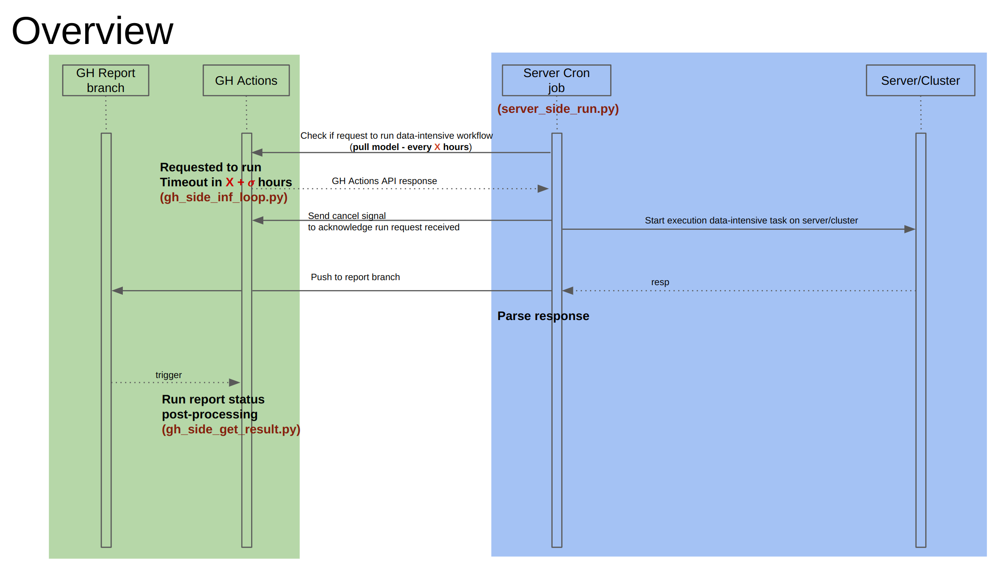

# Run GitHub Actions for Intensive task on external server
Workflow prototype to trigger intensive task on external server.

## Overview

The process is as below:

- [GH side] When someone trigger the GitHub Actions: `trigger_intensive_task`, it will start a GitHub Actions named `intensive-task`. `intensive-task` will run in infinite loop, it will timeout as set in `.github/workflows/trigger_intensive_task.yml` (30 minutes)

- [Server side] Run the script `server_side_run.py` as a cron job 30-x minutes. The script will track the workflow `intensive-task`, if there is any workflow as this type is called and the parameter is the same as its `machine_name`. If yes, the script will send a signal to cancel the workflow with its associcated ID and run the intensive task on the server. 

- [Server side] After finishing the intensive task, the server will push the result into `REPORT.md`, under `report` branch and the folder named `<machine_name>`. Notice: the first line in `REPORT.md` is the `intensive-task` workflow ID that this run is triggered.

- [GH side] A workflow will be triggered on push to `report` branch. It will return the link to the report and which `intensive-task` ID for this run.

## How to set up the prototype (assume that you fork the repository):

1. On the server:

    - Clone the repository: `https://github.com/<your_user_id>/test_workflow.git`
    - Create virtualenv and install required packages: 
        - `cd test_workflow`
        - `python -m venv venv`
        - `source activate venv/bin/activate`
        - `pip install -r requirements.txt`
    - Create `.env` that has the following fields:
        - `TOKEN`: your github token
        - `REPO`: `<your_user_id>/test_workflow`
        - `BRANCH`: `report`
        - `REPORT_PATH`: `report/{}/REPORT.md`
    - Create `config.yaml` from the `config_template.yaml`:
        - run_name: `intensive-task` - the workflow that you want to listen to on the server side
        - machine_name: `<your machine name>` - the name of your machine
2. On GitHub side:

    Go to Settings > Secrets and variables > Actions, add an environment secrets named `TOKEN`, which is your GitHub token.

## TODO
    - [] Test multiple users run and push report result to the repo.
    - [] Split report result into separate repo.
 

