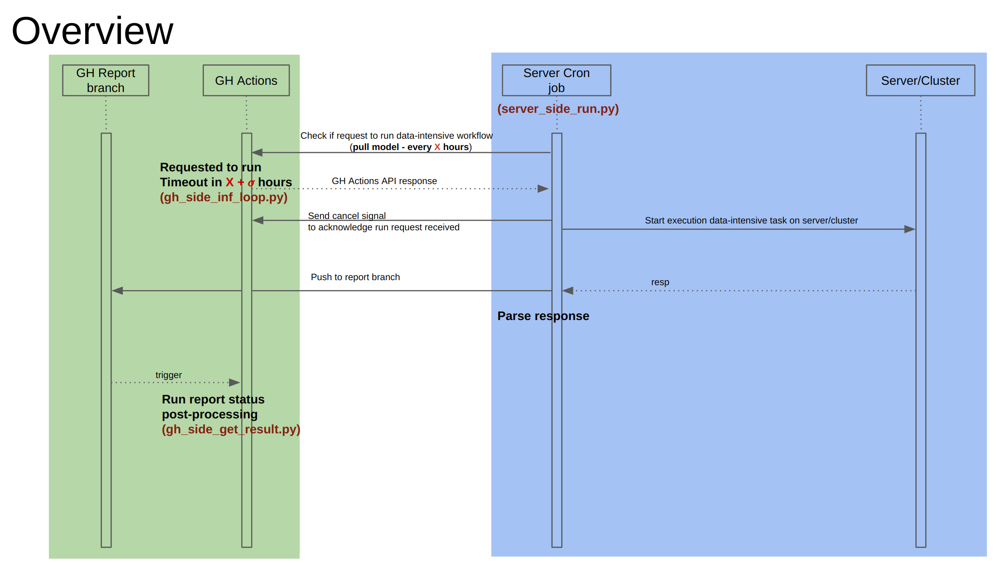

# FORTE: Flexible ONEFlux Run Tracker and Evaluator

**FORTE** is a comprehensive job execution system that integrates GitHub Actions with external server-side intensive task processing. The system provides a generalized, configurable job execution framework supporting multiple schedulers and workflow types, specifically designed for ONEFlux ecosystem workflows and data processing pipelines.

## What is FORTE?

**F**lexible **O**NEFlux **R**un **T**racker and **E**valuator - A modern, extensible workflow management system that:

- 🔄 **Tracks** ONEFlux pipeline executions across multiple compute environments
- 📊 **Evaluates** job performance and resource utilization
- 🚀 **Automates** workflow orchestration through GitHub Actions integration
- 🔧 **Adapts** to different HPC schedulers (SLURM, Local, and more)
- 📈 **Scales** from development laptops to production supercomputers

## Overview

The system operates on two main levels:

1. **GitHub Actions Integration**: Automated workflow triggering and result reporting through GitHub Actions
2. **Server-Side Job Execution**: A generalized job execution system supporting multiple schedulers (SLURM, Local) and workflow types

### Workflow Process



The complete process flow:

- **GitHub Side**: When someone triggers the GitHub Actions `trigger_intensive_task`, it starts a GitHub Actions workflow named `intensive-task`. This workflow runs in an infinite loop and will timeout as configured in `.github/workflows/trigger_intensive_task.yml` (default: 30 minutes)

- **Server Side**: The script `server_side_run.py` runs as a cron job every 30-x minutes. It tracks the `intensive-task` workflow, and if there is any workflow of this type with parameters matching its `machine_name`, the script sends a signal to cancel the workflow with its associated ID and executes the intensive task on the server

- **Server Side**: After completing the intensive task, the server pushes results to `REPORT.md` under the `report` branch in a folder named `<machine_name>`. The first line in `REPORT.md` contains the `intensive-task` workflow ID that triggered this run

- **GitHub Side**: A workflow is triggered on push to the `report` branch, returning the link to the report and the associated `intensive-task` ID

## Key Features

### Modular Architecture
- Abstract base classes for schedulers and workflows
- Plugin-style extensibility for new schedulers and workflow types
- Clean separation of concerns between job scheduling, workflow execution, and configuration

### Multiple Scheduler Support
- **SLURM** - Production HPC workload manager
- **Local** - Direct subprocess execution for testing/development
- **Extensible** - Easy to add new schedulers (Kubernetes, cloud services, etc.)

### Multiple Workflow Types
- **OneFlux** - Specialized workflow for OneFlux pipeline processing
- **Generic Python** - Execute arbitrary Python scripts
- **Custom Script** - Execute custom shell scripts
- **Extensible** - Easy to add new workflow types

### Configuration-Driven
- YAML configuration files with full validation
- Jinja2 templates for flexible job script generation
- Environment-specific settings without code changes
- Parameter validation to prevent runtime errors

### Enhanced Error Handling
- Comprehensive parameter validation before job submission
- Detailed error messages for troubleshooting
- Graceful failure handling with proper cleanup
- Logging and monitoring throughout the execution pipeline

## Project Structure

```
forte/
├── forte/                         # Main FORTE package
│   ├── __init__.py
│   ├── main.py                    # Main entry point
│   ├── constants.py               # System constants
│   ├── job_system/                # Core job system package
│   │   ├── __init__.py
│   │   ├── base.py                # Abstract base classes
│   │   ├── schedulers.py          # Scheduler implementations
│   │   ├── workflows.py           # Workflow implementations  
│   │   └── manager.py             # JobManager orchestrator
│   ├── utils/                     # Utility modules
│   │   └── logger.py              # Logging configuration
│   ├── templates/                 # Jinja2 job script templates
│   └── gh_scripts/                # GitHub integration scripts
├── scenarios/                     # Scenario configuration files
├── docs/                          # Documentation and web interface
├── config.yaml                   # Main configuration file
├── config_template.yaml          # Configuration template
├── setup.py                      # Package installation setup
├── requirements.txt               # Python dependencies
└── README.md                     # This documentation
```

## Configuration

### Main Configuration (`config.yaml`)

The system uses YAML configuration files. Create your `config.yaml` from `config_template.yaml`:

```yaml
# Scheduler configuration
scheduler:
  type: "slurm"  # Options: slurm, local, kubernetes
  
  slurm:
    default_params:
      qos: "regular"
      time: "01:00:00"
      nodes: 1
      constraint: "cpu"
      tasks_per_node: 1
      account: "YOUR_ACCOUNT"
      mail_user: "your.email@domain.com"
    template: "slurm_job.sh.j2"
    output_dir: "/path/to/your/output"

# Workflow type definitions
workflow_types:
  oneflux:
    command_template: "python {command} all {data_path} {siteid} {datadir} {firstyear} {lastyear} -l {log_path} --mcr {matlab_path} {custom_params}"
    required_params: ["siteid", "datadir", "firstyear", "lastyear"]
    optional_params: ["custom_params"]
    environment_setup:
      - "module load conda"
      - "conda activate oneflux"

# System paths
paths:
  oneflux_path: "/path/to/ONEFlux"
  matlab_path: "/path/to/matlab_runtime"
  command: "/path/to/oneflux_pipeline.py"
  script_output_dir: "/path/to/scripts"
  log_output_dir: "/path/to/logs"

# Machine configuration
machine:
  name: "YOUR_MACHINE_NAME"
  max_retries: 3
  availability_check:
    type: "slurm_queue"
    params:
      max_queued_jobs: 10
```

### Scenario Configuration

Define your workflows in scenario files:

```yaml
- machine: rocky
  scenarios:
    # OneFlux workflow
    - workflow_type: oneflux
      params:
        siteid: US-ARc
        datadir: US-ARc_sample_output
        firstyear: 2005
        lastyear: 2006
      custom_params:
        recint: hh
        era-ly: 2014
    
    # Generic Python workflow
    - workflow_type: generic_python
      params:
        script: /path/to/analysis.py
        args: "--input data --output results"
    
    # Custom script workflow
    - workflow_type: custom_script
      params:
        script_path: /path/to/process.sh
        args: "arg1 arg2"
```

## Setup Instructions

### Server Setup

1. **Clone the repository**:
   ```bash
   git clone https://github.com/<your_user_id>/test_workflow.git
   cd test_workflow
   ```

2. **Create virtual environment and install FORTE**:
   ```bash
   python -m venv venv
   source venv/bin/activate  # On Windows: venv\Scripts\activate
   pip install -e .  # Install FORTE in development mode
   ```

3. **Create environment file** (`.env`):
   ```
   TOKEN=your_github_token
   REPO=<your_user_id>/test_workflow
   BRANCH=report
   REPORT_PATH=report/{}/REPORT.md
   ```

4. **Create configuration file**:
   ```bash
   cp config_template.yaml config.yaml
   # Edit config.yaml with your specific settings
   ```

5. **Set up cron job** to run FORTE:
   ```bash
   # Add to crontab (adjust timing as needed)
   */25 * * * * cd /path/to/test_workflow && source venv/bin/activate && forte
   ```

## Usage

After installation, you can run FORTE in several ways:

### Command Line Interface
```bash
# Run FORTE with default config
forte

# Use custom configuration file
forte --config my_config.yaml

# Show help
forte --help

# Show version
forte --version
```

### Direct Python Execution
```bash
# Run as module
python -m forte.main

# Run script directly
python forte/main.py
```

### GitHub Setup

1. Go to **Settings > Secrets and variables > Actions**
2. Add an environment secret named `TOKEN` with your GitHub token value

## Usage

### Programmatic Usage

```python
from job_system.manager import JobManager

# Initialize JobManager
job_manager = JobManager('config.yaml')

# Submit a OneFlux workflow
job_id, success, message = job_manager.submit_workflow(
    workflow_type='oneflux',
    params={
        'siteid': 'US-ARc',
        'datadir': 'US-ARc_sample',
        'firstyear': 2020,
        'lastyear': 2021,
        'custom_params': {'recint': 'hh'}
    }
)

if success:
    print(f"Job submitted: {job_id}")
    
    # Check job status
    status = job_manager.check_job_status(job_id)
    print(f"Status: {status}")
else:
    print(f"Submission failed: {message}")
```

### Command Line Usage

```bash
# Run the main server script
python server_side_run.py
```

## Testing

The system includes comprehensive testing:

```bash
# Run the test suite
python test_job_system.py
```

Tests cover:
- JobManager initialization
- Configuration validation
- Parameter validation for all workflow types
- Scheduler availability checking
- Local job submission (if configured)
- Job status checking

## Extending the System

### Adding New Schedulers

To add a new scheduler (e.g., Kubernetes):

1. **Create scheduler class** in `job_system/schedulers.py`:

```python
class KubernetesScheduler(JobScheduler):
    def submit_job(self, job_script_path: str) -> Tuple[Optional[str], bool]:
        # Implement Kubernetes job submission
        pass
    
    def check_job_status(self, job_id: str) -> JobStatus:
        # Implement Kubernetes status checking
        pass
    
    # Implement other required methods...
```

2. **Add to JobManager** in `job_system/manager.py`
3. **Create template** in `templates/kubernetes_job.yaml.j2`
4. **Update configuration** to support the new scheduler

### Adding New Workflow Types

To add a new workflow type:

1. **Create workflow class** in `job_system/workflows.py`:

```python
class MLWorkflow(WorkflowType):
    def validate_params(self, params: Dict[str, Any]) -> Tuple[bool, List[str]]:
        # Implement parameter validation
        pass
    
    def build_command(self, params: Dict[str, Any], paths: Dict[str, str]) -> str:
        # Implement command building
        pass
    
    def get_environment_setup(self) -> List[str]:
        # Return environment setup commands
        pass
```

2. **Add to JobManager** in `job_system/manager.py`
3. **Update configuration** to define the new workflow type

## Status Mapping

The system maintains compatibility with existing logs through status mapping:

| JobStatus | Numeric | Description |
|-----------|---------|-------------|
| PENDING | 0 | Job is queued |
| RUNNING | 1 | Job is executing |
| COMPLETED | 2 | Job finished successfully |
| FAILED | 3 | Job failed due to code/data issues |
| CANCELLED | 4 | Job was cancelled (external failure) |
| TIMEOUT | 4 | Job timed out (external failure) |
| UNKNOWN | 4 | Status could not be determined |

## Scheduler-Specific Features

### SLURM Scheduler
- sbatch submission with full parameter support
- sacct status checking with detailed state mapping
- Queue availability checking based on user's queued jobs
- Automatic output file collection (.out/.err files)
- scancel job cancellation

### Local Scheduler  
- subprocess execution for development/testing
- Concurrent job limiting to prevent system overload
- Real-time status tracking via process polling
- Graceful job termination with proper cleanup


## Error Handling

The system provides comprehensive error handling:

- Configuration validation on startup
- Parameter validation before job submission  
- Scheduler availability checking before submission
- Graceful failure recovery with detailed error messages
- Proper cleanup of temporary files and processes

## Benefits Over Original System

| Aspect | Original | Refactored |
|--------|----------|------------|
| **Scheduler Support** | SLURM only | SLURM, Local, extensible |
| **Workflow Types** | OneFlux only | OneFlux, Python, Scripts, extensible |
| **Configuration** | Hardcoded paths | YAML-driven, validated |
| **Job Scripts** | Hardcoded template | Jinja2 templates |
| **Error Handling** | Basic | Comprehensive validation |
| **Testing** | None | Full test suite |
| **Extensibility** | Monolithic | Modular, plugin-based |
| **Maintainability** | Difficult | Clean architecture |

## Migration Notes

The refactored system provides enhanced functionality but requires migration:

1. **Update configuration files** to new YAML format
2. **Update scenario files** to include workflow_type specification  
3. **Install new dependencies** (Jinja2)
4. **Test thoroughly** with your specific workflows
5. **Update any custom scripts** that interact with the system

## TODO

- Test multiple users running and pushing report results to the repository
- Split report results into separate repository
- Add support for additional cloud schedulers (AWS Batch, Google Cloud)
- Implement workflow dependency management
- Add real-time monitoring dashboard

## Contributing

1. Fork the repository
2. Create a feature branch
3. Make your changes
4. Add tests for new functionality
5. Submit a pull request
